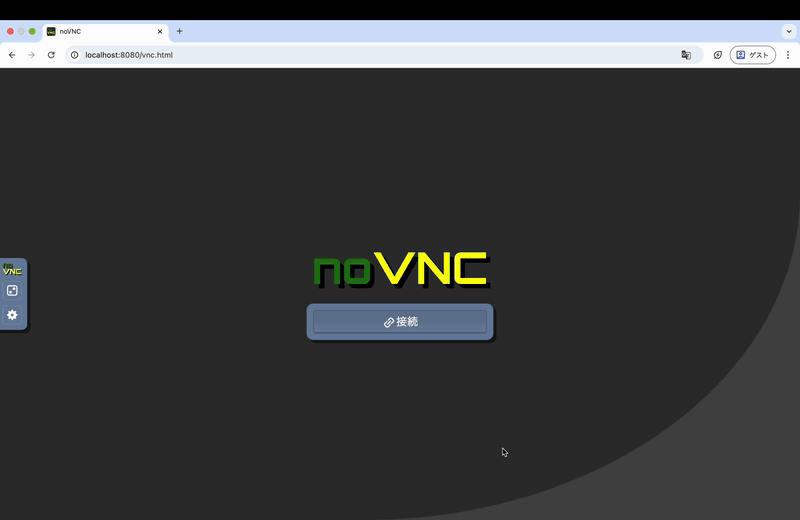
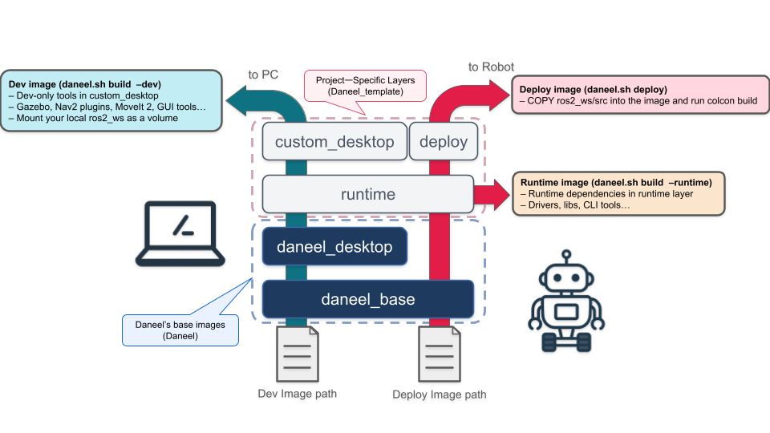

# Daneel_template

Project-specific layered ROS 2 dev & deploy environment on top of **[Daneel](https://github.com/ReitaY/Daneel)**.

On top of Daneel’s base images, this template ships a **noVNC + Fluxbox desktop**
so you can open a full Linux / ROS 2 dev environment from **any OS** (Windows,
macOS, Linux) as long as you have a browser.

<p align="center">
  
</p>

This repository provides a template for building per-project images on top of
Daneel’s base images, and for deploying them to a robot with as little friction
as possible.

---

## 1. What is this repository?

Daneel_template is a **project layer** that sits on top of the generic
Daneel images:

- **[Daneel](https://github.com/ReitaY/Daneel)**  
  - Provides common ROS 2 base images:
    - `daneel_base:<ROS_DISTRO>`
    - `daneel_desktop:<ROS_DISTRO>`
- **Daneel_template (this repo)**  
  - Adds **project-specific layers**:
    - Dev image for GUI development on your PC
    - Runtime image for your robot
    - Deploy image that bakes your `ros2_ws/src` into the container and runs
      `colcon build` inside

Typical use cases:

- You want the **same ROS 2 environment** on multiple machines.
- You want a **rich GUI dev environment** locally, but a **lean runtime image**
  on the robot.
- You want a **repeatable “build → deploy” path** for your ROS 2 workspace.

---

## 2. Layer & image structure

The overall idea looks like this:

<p align="center">
  
</p>

- **Daneel’s base images (blue)**  
  - `daneel_base` and `daneel_desktop` live in the Daneel repo and should be
    built / managed there.
- **Project-specific layers (white)** – provided by Daneel_template:
  - `custom_desktop` (dev-only tools: Gazebo, Nav2 plugins, MoveIt 2, GUI tools…)
  - `runtime` (runtime-only drivers, libs, CLI tools…)
  - `deploy` (tools for baking and building your `ros2_ws` inside the image)

From these layers we build three main images:

- **Dev image (`daneel.sh build --dev`) – PC side**
  - Stack: `daneel_base` → `daneel_desktop` → `custom_desktop`
  - Use for interactive development with noVNC/VNC desktop.
  - Mount your local `ros2_ws` as a volume so you can iterate quickly.

- **Runtime image (`daneel.sh build --runtime`) – robot side**
  - Stack: `daneel_base` → `daneel_desktop` → `runtime`
  - Contains runtime-only dependencies:
    - Hardware drivers
    - ROS 2 libs and CLI tools
    - Minimal debug utilities

- **Deploy image (`daneel.sh deploy`) – build & ship code**
  - Stack: `daneel_base` → `daneel_desktop` → `runtime` → `deploy`
  - Copies `ros2_ws/src` **into** the image, runs `colcon build` in the
    container, and produces a ready-to-run image for the robot.

---

## 3. Repository layout

```text
.
├── compose
│   ├── dev.yml          # Dev desktop stack (PC side)
│   └── robot.yml        # Runtime / deploy stack (robot side)
├── docker
│   ├── deploy
│   │   └── Dockerfile.deploy      # Deploy image (bakes ros2_ws + colcon build)
│   └── project
│       ├── Dockerfile.desktop     # Dev image (custom_desktop layer)
│       └── Dockerfile.runtime     # Runtime image (runtime layer)
├── docs
│   └── images
│       └── Daneel_concept.png     # Diagram used in this README
├── LICENSE
├── README.md
├── ros2_ws
│   └── src                        # Your ROS 2 packages go here
├── scripts
│   ├── clean_images.sh            # Helper to delete project images
│   └── daneel.sh                  # Main CLI entry point
└── .env.example                   # Template for project configuration
```

You are expected to:

- Put your project packages under `ros2_ws/src`.
- Customize the Dockerfiles under `docker/project` and `docker/deploy`.
- Use `scripts/daneel.sh` as the main interface instead of raw Docker commands.

---

## 4. `daneel.sh` CLI

`./scripts/daneel.sh` wraps common operations around this template.

The exact options may evolve, but the core subcommands are:

### 4.1 `init`

```sh
./scripts/daneel.sh init
```

- Copies `.env.example` to `.env` (if not present).
- Optionally asks a few questions and fills in defaults.
- After running this, you should have a `.env` file with all parameters needed
  by this template.

Parameters configured via `.env` include for example:

- **Project & ROS**
  - `PROJECT_NAME`
  - `ROS_DISTRO`
- **Base images (from Daneel)**
  - `DANEEL_BASE_IMAGE`
  - `DANEEL_DESKTOP_IMAGE`
- **GUI / networking**
  - `DISPLAY_WIDTH`, `DISPLAY_HEIGHT`
  - `NOVNC_PORT`, `VNC_PORT`
  - `ROS_DOMAIN_ID`
  - `RMW_IMPLEMENTATION`
- **Robot deployment**
  - `ROBOT_HOST`
  - `ROBOT_SSH_PORT`
  - `ROBOT_STACK_DIR`
- **Using a local Daneel repo (optional)**
  - `DANEEL_USE_LOCAL_BUILD`
  - `DANEEL_LOCAL_DIR`

You can always open `.env` and edit these by hand after `init`.

---

### 4.2 `build`

```sh
# Build only the dev image (PC desktop)
./scripts/daneel.sh build --dev

# Build only the runtime image (robot runtime)
./scripts/daneel.sh build --runtime
```

- Uses the Dockerfiles under `docker/project` and the base image names from `.env`.
- Tags images using `${PROJECT_NAME}` and the selected role (dev / runtime).

Typically you’ll run:

1. `build --dev` on your PC to get the dev desktop.
2. `build --runtime` (and later `deploy`) for the robot side.

---

### 4.3 `deploy`

```sh
./scripts/daneel.sh deploy
```

Conceptually:

- Builds the **deploy image** using `docker/deploy/Dockerfile.deploy`.
- Copies `ros2_ws/src` from this repo into the image.
- Runs `colcon build` inside the container so that the resulting image already
  contains a built workspace.
- Optionally pushes / ships the image to `${ROBOT_HOST}` and/or prepares it to
  be used with `compose/robot.yml`.

This command is the “right-hand path” in the diagram: the one that goes from
your PC to the robot via the deploy image.

---

### 4.4 Cleaning images

```sh
./scripts/clean_images.sh
```

- Convenience script to remove all project images built by this template.
- It will ask for confirmation before actually deleting anything, so you can
  safely run it when you want to reset your local image set.

---

## 5. Setup

### 5.1 Prerequisites

- Docker (and Docker Compose plugin).
- A working set of **Daneel base images**:
  - `daneel_base:<ROS_DISTRO>`
  - `daneel_desktop:<ROS_DISTRO>`
- (Optional) NVIDIA container runtime, if you need GPU support.

How you obtain the Daneel images (build locally vs. pull from a registry) is
left to your environment; just make sure the image names match what is written
in `.env`.

---

### 5.2 Initialize configuration (`.env`)

1. Clone this repository.
2. Run:

   ```sh
   cd Daneel_template
   ./scripts/daneel.sh init
   ```

3. Confirm / adjust the values that are written into `.env`.
4. If needed, manually tweak `.env` after the fact.

You can always regenerate `.env` by re-running `init` (or simply copying
`.env.example`), but be careful not to overwrite custom changes you care about.

---

## 6. Building images

After `init` has created `.env`, you can build each image.

### 6.1 Dev image (PC desktop)

```sh
./scripts/daneel.sh build --dev
```

- Builds the dev image used by `compose/dev.yml`.
- Extends `daneel_desktop` with:
  - GUI tools (RViz, Gazebo, MoveIt 2 etc., depending on your Dockerfile).
  - Development tooling (compilers, editors, debugging tools).
- At runtime you typically **mount your local `ros2_ws`** as a volume.

### 6.2 Runtime image (robot runtime)

```sh
./scripts/daneel.sh build --runtime
```

- Builds the runtime image for robot-side execution.
- Uses a slimmer layer on top of `daneel_desktop` focused on:
  - Hardware drivers
  - ROS 2 runtime dependencies
  - Minimal debugging tools
- Intended to be used via `compose/robot.yml` on the robot.

### 6.3 Deploy image (baked workspace)

```sh
./scripts/daneel.sh deploy
```

- Copies `ros2_ws/src` into the image.
- Runs `colcon build` inside the container.
- Outputs a self-contained image that includes the built workspace, ready to be
  run on the robot (often via `compose/robot.yml`).

---

## 7. Development workflow (PC side)

Typical loop for daily development:

1. **Build / update the dev image** when the environment changes:

   ```sh
   ./scripts/daneel.sh build --dev
   ```

2. **Start the dev desktop container**:

   ```sh
   docker compose -f compose/dev.yml up   # add -d for detached
   ```

   - `compose/dev.yml` will typically:
     - Use the dev image built above.
     - Mount `./ros2_ws` into the container.
     - Expose `${NOVNC_PORT}` / `${VNC_PORT}`.

3. **Connect via browser**:

   - Open `http://localhost:${NOVNC_PORT}` and log into the container desktop.

4. **Develop inside the container**:

   ```sh
   cd /workspace/ros2_ws
   colcon build
   ros2 launch ...
   ```

5. When you change system dependencies (apt, pip, etc.), update
   `docker/project/Dockerfile.desktop`, rebuild the dev image, and restart.

---

## 8. Robot deployment workflow

Once your code is stable enough to test on the robot:

1. **Build / update the runtime image**:

   ```sh
   ./scripts/daneel.sh build --runtime
   ```

2. **Create a baked deploy image from your current `ros2_ws/src`**:

   ```sh
   ./scripts/daneel.sh deploy
   ```

   - This step runs `colcon build` inside the container so you don’t have to
     compile on the robot.

3. (Optional) **Ship the image to the robot** — depending on how `deploy` is
   implemented, it may:
   - Push to a registry and pull from the robot.
   - Or build directly on the robot via SSH.

4. **Run the robot stack**:

   On the robot (or via your deploy tooling), start:

   ```sh
   docker compose -f compose/robot.yml up
   ```

   - `robot.yml` typically uses either:
     - The runtime image (plus mounted `ros2_ws`), or
     - The baked deploy image (no volume needed).

The exact pattern is up to your project, but this template is designed so that
“dev on PC” and “run on robot” share the same base, while still being separated
into appropriate images.

---

## 9. Configuration reference (`.env`)

A few important parameters you will likely want to adjust:

- **Project / ROS**
  - `PROJECT_NAME` – image name prefix.
  - `ROS_DISTRO` – e.g. `humble`.
- **Daneel base images**
  - `DANEEL_BASE_IMAGE` – e.g. `daneel_base:${ROS_DISTRO}`.
  - `DANEEL_DESKTOP_IMAGE` – e.g. `daneel_desktop:${ROS_DISTRO}`.
- **GUI & ports**
  - `DISPLAY_WIDTH`, `DISPLAY_HEIGHT`
  - `NOVNC_PORT` – port for noVNC.
  - `VNC_PORT` – port for raw VNC.
- **ROS networking**
  - `ROS_DOMAIN_ID`
  - `RMW_IMPLEMENTATION`
- **Robot deployment**
  - `ROBOT_HOST` – hostname / IP of the robot.
  - `ROBOT_SSH_PORT`
  - `ROBOT_STACK_DIR` – directory on the robot where the stack will live.
- **Local Daneel repo (optional)**
  - `DANEEL_USE_LOCAL_BUILD` – `0` or `1`.
  - `DANEEL_LOCAL_DIR` – path to local Daneel repo when `USE_LOCAL_BUILD=1`.

---

## 10. Troubleshooting

A few common issues:

- **noVNC does not open**
  - Check that `compose/dev.yml` exposes `${NOVNC_PORT}`.
  - Confirm the container is running: `docker ps`.
  - Check firewall / port conflicts.

- **ROS 2 topics do not appear across machines**
  - Verify `ROS_DOMAIN_ID` and `RMW_IMPLEMENTATION` match across containers.
  - Make sure your network allows multicast or configure DDS accordingly.

- **Robot cannot pull / run the image**
  - Confirm that `ROBOT_HOST`, `ROBOT_SSH_PORT` and `ROBOT_STACK_DIR` in `.env`
    are correct.
  - Check that your `deploy` step is actually shipping the image or running
    `docker compose` on the robot.

- **Images piling up**
  - Run `./scripts/clean_images.sh` and follow the confirmation prompt to
    remove template-related images.

---

## 11. License

This project is licensed under the terms described in `LICENSE`.
Please review that file for details.
